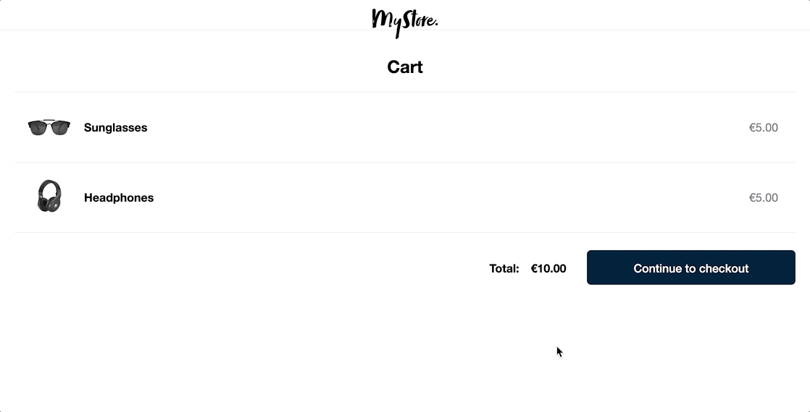

# Adyen Rails [Online Payment](https://docs.adyen.com/online-payments) integration demos

## Details

This repository includes examples of PCI-compliant UI integrations for online payments with Adyen. Within this demo app, you'll find a simplified version of an e-commerce website, complete with commented code to highlight key features and concepts of Adyen's API. Check out the underlying code to see how you can integrate Adyen to give your shoppers the option to pay with their preferred payment methods, all in a seamless checkout experience.



The demo leverages Adyen's API Library for Ruby ([GitHub](https://github.com/Adyen/adyen-ruby-api-library) | [Docs](https://docs.adyen.com/development-resources/libraries?tab=ruby_6_7#ruby)).

## Supported Integrations

[Online payments](https://docs.adyen.com/online-payments) **Ruby on Rails** demos of the following client-side integrations are currently available in this repository:

- Drop-in
- Components
  - ACH
  - Alipay
  - Card (3DS2)
  - iDEAL
  - Dotpay
  - giropay
  - SEPA Direct Debit
  - SOFORT

See **app/models/checkout.rb** for payment methods.

## Requirements

Ruby 3.1.1+

## Quick Start with GitHub Codespaces

This repository is configured to work with [GitHub Codespaces](https://github.com/features/codespaces). Click the badge below to launch a Codespace with all dependencies pre-installed.

[](https://github.com/codespaces/new/adyen-examples/adyen-rails-online-payments?ref=main&devcontainer_path=.devcontainer%2Fdevcontainer.json)

For detailed setup instructions, see the [GitHub Codespaces Instructions](https://github.com/adyen-examples/.github/blob/main/pages/codespaces-instructions.md).

## Local Installation

1. Clone this repo:

```
git clone https://github.com/adyen-examples/adyen-rails-online-payments.git
```

2. Navigate to the root directory and install dependencies:

```
bundle install
```

3. Update **config/local_env.yml** with your credentials. You can also set the following environment variables in your terminal:

  - PORT (default 8080)
  - [API key](https://docs.adyen.com/user-management/how-to-get-the-api-key)
  - [Client Key](https://docs.adyen.com/user-management/client-side-authentication)
  - [Merchant Account](https://docs.adyen.com/account/account-structure)
  - [HMAC Key](https://docs.adyen.com/development-resources/webhooks/verify-hmac-signatures)

```yaml
PORT: "8080"
ADYEN_HMAC_KEY: "YOUR_HMAC_KEY_HERE"
ADYEN_API_KEY: "YOUR_API_KEY_HERE"
ADYEN_MERCHANT_ACCOUNT: "YOUR_MERCHANT_ACCOUNT_HERE"
ADYEN_CLIENT_KEY: "YOUR_CLIENT_KEY_HERE"
```

4. Configure allowed origins (CORS)
- It is required to specify the domain or URL of the web applications that will make requests to Adyen. In the Customer Area, add `http://localhost:8080` in the list of Allowed Origins associated with the Client Key.

5. Start the server (and run any migrations if prompted):

```
bundle exec rails s
```

6. Visit [http://localhost:8080/](http://localhost:8080/) and select an integration type.

To try out integrations with test card numbers and payment method details, see [Test card numbers](https://docs.adyen.com/development-resources/test-cards/test-card-numbers).

# Webhooks

Webhooks deliver asynchronous notifications about the payment status and other events that are important to receive and process. 

You can find more information about webhooks in [this blog post](https://www.adyen.com/blog/Integrating-webhooks-notifications-with-Adyen-Checkout).

### Webhook setup

In the Customer Area under the `Developers → Webhooks` section, [create](https://docs.adyen.com/development-resources/webhooks/#set-up-webhooks-in-your-customer-area) a new `Standard webhook`.

A good practice is to set up basic authentication, copy the generated HMAC Key and set it as an environment variable. The application will use this to verify the [HMAC signatures](https://docs.adyen.com/development-resources/webhooks/verify-hmac-signatures/).

Make sure the webhook is **enabled**, so it can receive notifications.

### Expose an endpoint

This demo provides a simple webhook implementation exposed at `/api/webhooks/notifications` that shows you how to receive, validate and consume the webhook payload.

### Making your server reachable

Your endpoint that will consume the incoming webhook must be publicly accessible.

There are typically 2 options:
* deploy on your own cloud provider
* expose your localhost with tunneling software (i.e. ngrok)

#### Option 1: cloud deployment
If you deploy on your cloud provider (or your own public server) the webhook URL will be the URL of the server 
```
  https://{cloud-provider}/api/webhooks/notifications
```

#### Option 2: localhost via tunneling software
If you use a tunneling service like [ngrok](ngrok) the webhook URL will be the generated URL (ie `https://c991-80-113-16-28.ngrok.io`)

```bash
  $ ngrok http 8080
  
  Session Status                online                                                                                           
  Account                       ############                                                                      
  Version                       #########                                                                                          
  Region                        United States (us)                                                                                 
  Forwarding                    http://c991-80-113-16-28.ngrok.io -> http://localhost:8080                                       
  Forwarding                    https://c991-80-113-16-28.ngrok.io -> http://localhost:8080           
```

**Note:** when restarting ngrok a new URL is generated, make sure to **update the Webhook URL** in the Customer Area

### Test your webhook

The following webhooks `events` should be enabled:

* **AUTHORISATION**

To make sure that the Adyen platform can reach your application, we have written a [Webhooks Testing Guide](https://github.com/adyen-examples/.github/blob/main/pages/webhooks-testing.md) that explores several options on how you can easily achieve this (e.g. running on localhost or cloud).

## Contributing

We commit all our new features directly into our GitHub repository. Feel free to request or suggest new features or code changes yourself as well!

Find out more in our [Contributing](https://github.com/adyen-examples/.github/blob/main/CONTRIBUTING.md) guidelines.

## License

MIT license. For more information, see the **LICENSE** file in the root directory.
